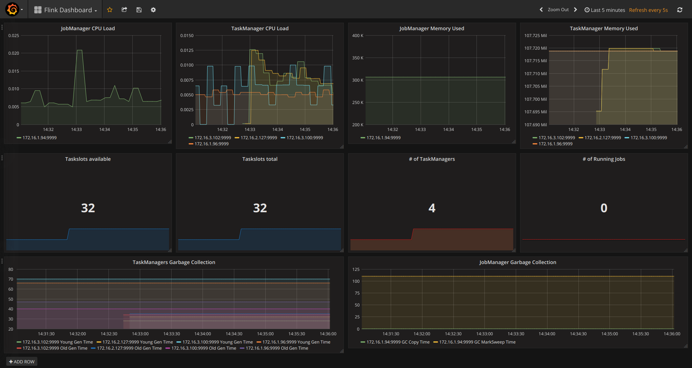

kubectl port-forward -n flink service/flink-jobmanager 8081:8081
Now it runs on localhost.

---

# Flink K8s setup with Prometheus service discovery
This repository hosts manifests to configure a Kubernetes cluster with
Flink monitored by Prometheus and Grafana using service discovery. Flink
instances are automatically recognized and scraped by Prometheus.

The Docker image used in this setup can be found
[here](https://hub.docker.com/r/wzorgdrager/flink-prometheus).

## Prerequisites
- Kubernetes setup with
[kubectl](https://kubernetes.io/docs/tasks/tools/install-kubectl/)
installed.

## TL;DR
```sh
git clone https://github.com/wzorgdrager/flink-k8s
kubectl apply -R -f ./flink-k8s/
kubectl port-forward -n monitoring service/grafana 3000:3000
```

Access Grafana Flink Dashboard on
[localhost:3000](http://localhost:3000/dashboard/db/flink-dashboard?refresh=5s&orgId=1). This might take a few minutes.

Grafana login details  
username: **flink**  
password: **flink-awesome**  

## Installation

Clone the repository and apply all configurations:
```sh
git clone https://github.com/wzorgdrager/flink-k8s
cd flink-k8s
kubectl apply -f ./01-prometheus/
kubectl apply -f ./02-flink/
kubectl apply -f ./03-grafana/
```

This deploys a prometheus instance, a grafana instance and a Flink
cluster with **one** JobManager and **two** TaskManagers (consisting of
16 taskslots each). Flink is configured and deployed to expose
(Prometheus) metrics on port **9999** for each Job and TaskManager.
Prometheus scrapes Kubernetes endpoints based on a JobManager service
and headless TaskManager service routing to the correct metric
endpoints. See [architecture](#architecture) for a global view. After
deploying all the manifests:

- The JobManager can be accessed by port-forwarding it:<br> `kubectl
port-forward -n flink service/flink-jobmanager 8081:8081` <br> Now it
runs on [localhost](http://localhost:8081).
- The Grafana dashboard can be accessed by port-forwarding as well: <br>
`kubectl port-forward -n monitoring service/grafana 3000:3000` <br> Now
it runs on [localhost](http://localhost:3000). <br> Username: **flink**,
password: **flink-awesome**. A Flink dashboard has been imported
already. It should look like this: <br> 


To see the service discovery working scale the TM instances from **two**
to **four**:  
`kubectl -n flink  scale deployment flink-taskmanager
--replicas=4`:

You can see these instances pop-up on the [Grafana
dashboard](http://localhost:3000/dashboard/db/flink-dashboard?refresh=5s&orgId=1):  


## Architecture


## References
Most manifests in this repository are based on the following sources:
- [Prometheus manifests](https://github.com/giantswarm/prometheus)
- [Prometheus setup
blog](https://sysdig.com/blog/kubernetes-monitoring-prometheus/)
- [Flink Kubernetes
manifests](https://ci.apache.org/projects/flink/flink-docs-stable/ops/deployment/kubernetes.html) 
